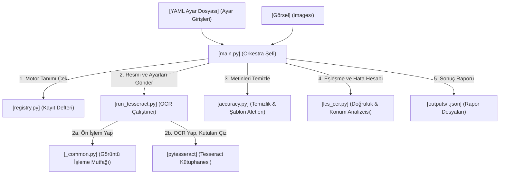

# OCR Performans Analiz Projesi: Fonksiyon ve Değişken Sözlüğü

Bu döküman, projedeki tüm fonksiyonların ve kritik değişkenlerin soy ağacını, ne işe yaradıklarını ve birbirleriyle nasıl haberleştiklerini en ince detayına kadar açıklayan bir başvuru kılavuzudur. Çalışırken kafana takılan her değişken için buraya bakabilirsin.

---

## 1. Proje Genel Veri Akış Şeması (Mermaid)



---

## 2. Fonksiyonlar Sözlüğü

Aşağıdaki tablo, projedeki kendi yazdığımız tüm fonksiyonların detaylı listesidir:

| Fonksiyon Adı | Bulunduğu Dosya | Girdileri (Parametreler) | Çıktısı (Return Değeri) | Ne İşe Yarar? |
| :--- | :--- | :--- | :--- | :--- |
| `load_config` | `_common.py` | `config_path` (Dosya yolu) | `dict` (Ayar sözlüğü) | YAML dosyasını Türkçe karakter uyumlu açıp okur. |
| `resolve_font_path` | `_common.py` | `config_font_path` (Opsiyonel) | `str` (Yazı tipi yolu) veya `None` | İşletim sistemine göre Türkçe karakter destekleyen bir font bulur. |
| `filter_valid_kwargs` | `_common.py` | `func` (Fonksiyon), `kwargs` (Ayarlar) | `dict` (Süzülmüş ayarlar) | Ayar dosyasındaki geçersiz parametreleri eler, çökmeyi önler. |
| `_deskew` | `_common.py` | `gray` (Gri resim matrisi) | `ndarray` (Döndürülmüş resim) | Hafif yan veya eğri duran resimleri otomatik döndürüp yatay yapar. |
| `_autocrop_border` | `_common.py` | `gray` (Gri resim), `margin_ratio` | `ndarray` (Kırpılmış resim) | Resmin kenarlarındaki gereksiz boş şeritleri kesip atar. |
| `_correct_illumination` | `_common.py` | `gray` (Gri resim), `kernel_size` | `ndarray` (Aydınlanmış resim) | Resmin üzerine düşen gölgeleri ve düzensiz ışığı siler. |
| `preprocess_image` | `_common.py` | `img` (Ham resim), `settings` | `ndarray` (Ön işlenmiş resim) | Tüm ön işlem adımlarını (kırpma, döndürme vb.) sırayla yönetir. |
| `save_preprocessed_image`| `_common.py` | `ocr_input`, `preprocessed_dir`, `img_name` | `str` (Kaydedilen dosya yolu) | OCR motorunun okuduğu resmin ön işlenmiş halini diske kaydeder. |
| `get_viz_dirs` | `_common.py` | `config_path`, `base_output_dir` | `tuple` (3 adet klasör yolu) | Rapor ve görselleştirme klasörlerini oluşturup yollarını döner. |
| `build_tesseract_config` | `run_tesseract.py` | `ocr_settings` (Ayarlar) | `str` (Tesseract ayar metni) | Ayarları Tesseract'ın anlayacağı `--psm 6 --oem 3` diline çevirir. |
| `run_tesseract` | `run_tesseract.py` | `image_path`, `config_path` | `dict` (OCR okuma sonuçları) | Resmi okutur, kırmızı kutuları ve beyaz sayfayı çizer. |
| `turkish_lower` | `accuracy.py` | `text` (Metin) | `str` (Küçük harfli metin) | Türkçe büyük İ->i ve I->ı dönüşümlerini hatasız yapar. |
| `turkish_to_ascii` | `accuracy.py` | `text` (Metin) | `str` (İngilizce harfli metin) | Türkçe aksanlı harfleri (ş->s, ü->u vb.) İngilizceye çevirir. |
| `normalize_text` | `accuracy.py` | `text`, `ascii_normalize` | `str` (Temizlenmiş metin) | Noktalamaları siler, harfleri küçültür, boşlukları sadeleştirir. |
| `load_common_fields` | `accuracy.py` | `common_fields_path` | `dict` (Sabit kelimeler) | Sabit kelimelerin olduğu `.txt` dosyasını okuyup listeler. |
| `detect_common_fields_file`| `accuracy.py` | `img_name`, `common_fields_dir` | `Path` (Dosya yolu) veya `None` | Resim adına göre hangi sabit kelime şablonunun kullanılacağını bulur. |
| `_compute_cer_wer` | `lcs_cer.py` | `norm_ref`, `matched_substring` | `tuple` (`cer`, `wer` oranları) | Karakter (CER) ve Kelime (WER) hata oranlarını hesaplar. |
| `find_lcs_match` | `lcs_cer.py` | `reference`, `predicted_text` | `dict` (Eşleşme sonucu) | Metin içinde en uzun ortak parçayı bulur ve hata hesabı yapar. |
| `_normalize_with_position_map`| `lcs_cer.py` | `text`, `ascii_normalize` | `tuple` (Metin, Pozisyon Haritası) | Metni temizlerken, her harfin orijinal yerini tutan köprüyü kurar. |
| `find_lcs_match_with_bbox` | `lcs_cer.py` | `reference`, `words` | `dict` (Eşleşme ve piksel konumu) | Eşleşen kelimenin resmin tam olarak neresinde olduğunu bulur. |
| `check_all_fields_lcs_cer_with_bbox`| `lcs_cer.py` | `fields`, `words` | `dict` (Genel karne) | Tüm alanların doğruluk ve resimdeki piksel yerlerini topluca ölçer. |
| `find_best_matching_field_lcs`| `lcs_cer.py` | `word_text`, `fields` | `dict` (En iyi eşleşen alan) | Tek bir kelimenin en çok hangi başlığa benzediğini tespit eder. |
| `enrich_words_with_field_matches_lcs`| `lcs_cer.py` | `words`, `fields` | `list` (Etiketli kelimeler listesi) | Resimdeki tüm kelimelerin üzerine hangi alana ait olduğunu etiketler. |

---

## 3. Kritik Değişkenler Sözlüğü

Aşağıdaki değişkenler programın can damarlarıdır ve tüm kod dosyalarında sıklıkla karşımıza çıkarlar:

### 1. `words` Listesi (Okunan Kelimeler Haritası)
* **Türü:** `list` (İçinde sözlükler barındıran bir liste)
* **Nerede Doğar?:** `run_tesseract.py` dosyasındaki döngüde (Satır 144) oluşturulur.
* **İçeriği:**
  ```python
  words = [
      {
          "text": "ahmet",
          "bbox": [100, 150, 250, 180], # [sol, üst, sağ, alt] piksel konumları
          "confidence": 92.5
      }
  ]
  ```
* **Ne İçin Kullanılır?:** Web arayüzüne gönderilen en önemli veridir. Arayüz bu listeyi okuyarak resim üzerinde kelimelerin yerini çizer.

### 2. `position_map` (Pozisyon Köprüsü)
* **Türü:** `list` (Tam sayılardan oluşan liste)
* **Nerede Doğar?:** `lcs_cer.py` dosyasındaki `_normalize_with_position_map` fonksiyonunda.
* **Mantığı:**
  Noktalama işaretleri silinmiş temizlenmiş metindeki her harfin, orijinal ham metindeki sıra numarasını (indeksini) taşır.
  * *Örnek:* Ham metin `"AD: AHMET"` olsun. Temizlenmiş hali `"ad ahmet"` olur.
  * Temizlenmiş haldeki `a` harfinin indeksi `3`'tür. 
  * `position_map[3]` değeri bize `4` değerini verir. Çünkü orijinal ham metinde `a` harfi 4. sıradadır.
* **Ne İçin Kullanılır?:** Temizlenmiş metin üzerinde yaptığımız aramaların sonuçlarını, resim üzerindeki gerçek piksel koordinatlarıyla (BBox) eşleştirebilmek için köprü görevi görür.

### 3. `bbox` ve `bboxes` (Sınır Kutuları)
* **Türü:** `list` (Piksel koordinat sayıları)
* **Nerede Doğar?:** `lcs_cer.py` dosyasındaki `find_lcs_match_with_bbox` fonksiyonunda (Satır 457-458).
* **Farkları:**
  * **`bbox`**: Eşleşen kelimelerin tamamını çevreleyen **tek bir büyük dikdörtgen** koordinatıdır: `[en_sol, en_ust, en_sag, en_alt]`.
  * **`bboxes`**: Eşleşen kelimelerin her birinin **kendi ayrı dar kutucuklarının** listesidir.

### 4. `cer` ve `wer` (Hata Puanları)
* **Türü:** `float` (Ondalık sayı, 0.0 ile 1.0+ arası)
* **Nerede Doğar?:** `lcs_cer.py` dosyasındaki `_compute_cer_wer` fonksiyonunda.
* **Anlamları:**
  * **`cer` (Character Error Rate):** Harf hata oranıdır. 0.0 sıfır hata demektir. 0.20 ise %20 harf hatası olduğunu belirtir.
  * **`wer` (Word Error Rate):** Kelime hata oranıdır. Kelime bazında karşılaştırma yapar.

### 5. `fields` (Doğru Cevap Anahtarı)
* **Türü:** `dict` (Sözlük)
* **Nerede Doğar?:** `main.py` dosyasında YAML dosyasından veya txt dosyasından okunarak yüklenir.
* **İçeriği:**
  `{"ad": "AHMET", "soyad": "YILMAZ"}`
* **Ne İçin Kullanılır?:** OCR motorunun sonuçlarını kıyasladığımız referans (hedef) veridir.

---

## 4. Bir Resmin Kod İçindeki Adım Adım Yolculuğu

Bir resmi okutup doğruluk testini bitirene kadar arka planda çağrılan fonksiyonlar ve veri değişimleri sırasıyla şöyledir:

1. **`main.py`** resmi alır -> **`run_tesseract(resim_yolu, ayar_yolu)`** fonksiyonunu çağırır.
2. **`run_tesseract`** içinde:
   * **`load_config(ayar_yolu)`** çağrılır ve ayarlar sözlüğü alınır.
   * **`cv2.imread(resim_yolu)`** ile resim diskten okunur.
   * **`preprocess_image(resim, ayarlar)`** çağrılır. Bu fonksiyonun içinden sırayla:
     * **`cv2.resize`** (Resmi büyütür).
     * **`_deskew`** (Eğriyse döndürür).
     * **`_autocrop_border`** (Kenar boşluklarını siler).
     * **`_correct_illumination`** (Gölgeleri temizler).
     * **`cv2.adaptiveThreshold`** (Siyah-beyaz yapar).
   * **`pytesseract.image_to_data`** ile Tesseract motoruna ön işlenmiş temiz resim verilir. Kelimeler ve koordinatlar (`words` listesi) çıkarılır.
   * **`save_preprocessed_image`** ile temiz resim diske kaydedilir.
   * **`cv2.addWeighted`** ile orijinal resmin üzerine yarı saydam kırmızı kutular (`highlighted_dir`) çizilip kaydedilir.
   * Sonuçlar (`text` ve `words`) geriye döndürülür.
3. **`main.py`** sonuçları alır -> **`load_ground_truth(resim_adi)`** ile cevap anahtarını (`fields`) yükler.
4. **`main.py`** -> **`enrich_words_with_field_matches_lcs(words, fields)`** fonksiyonunu çağırır.
   * Bu fonksiyonun içinden her kelime için **`find_best_matching_field_lcs`** çağrılır. Her kelimeye hangi alana ait olduğu bilgisi etiketlenir.
5. **`main.py`** -> **`check_all_fields_lcs_cer_with_bbox(fields, words)`** fonksiyonunu çağırır.
   * Bu fonksiyon içinden her bir alan için **`find_lcs_match_with_bbox`** çağrılır. Eşleşen kelimelerin hata oranları (CER/WER) ve resimdeki piksel yerleri (`bbox`) hesaplanır.
6. **`main.py`** tüm bu sonuçları tek bir büyük rapor dosyası haline getirir ve **`json.dump`** ile `outputs/` klasörüne kaydeder.
